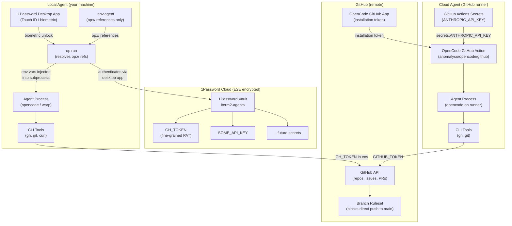
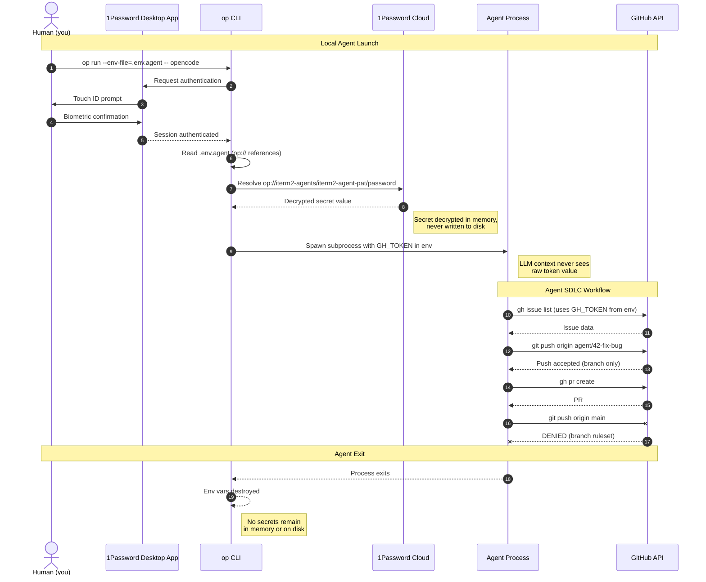
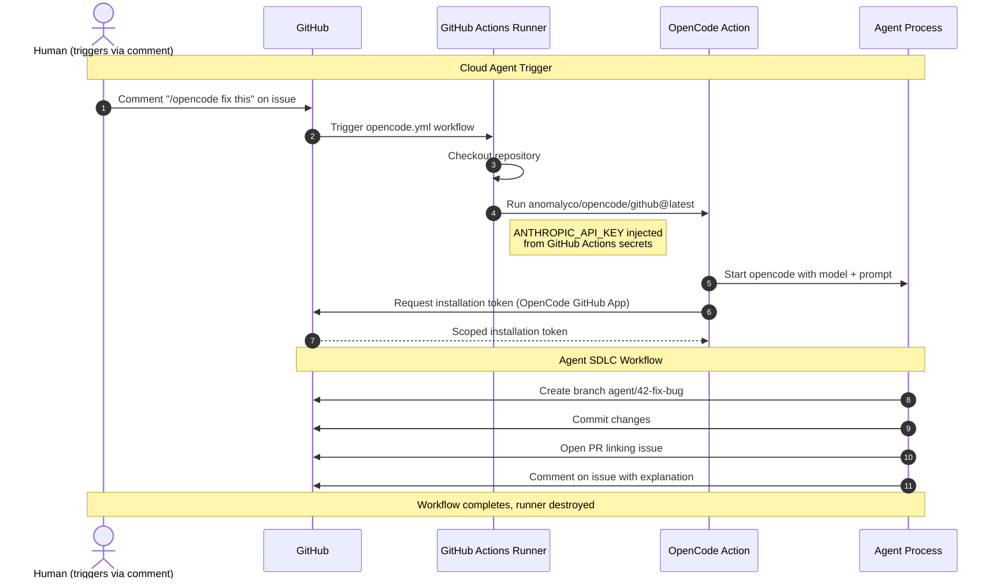
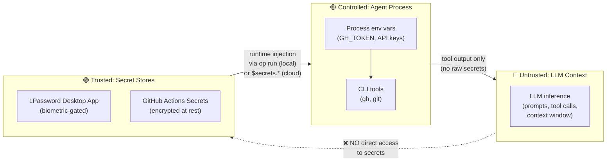
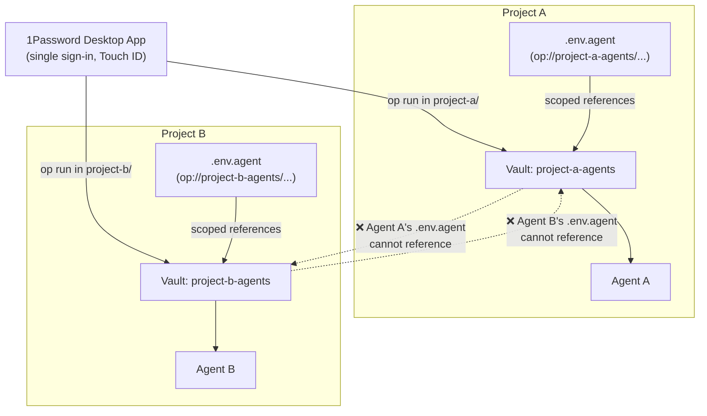

# Agent Secret Management

This guide covers how AI agents securely access secrets in two modes:
- **Local agents** (Warp, opencode TUI) — 1Password desktop app + `op run`
- **Cloud agents** (OpenCode GitHub) — GitHub Actions secrets + OpenCode GitHub App

## Security Principles for AI Agents

AI agents introduce a fundamentally different threat model than traditional server-side applications. An agent's LLM operates in an untrusted inference environment with open-ended context windows and memory. Secrets passed into prompts, embeddings, or agent context cannot be revoked and may be cached, shared with downstream tools, or leaked via prompt injection.

This architecture is designed around four principles aligned with industry best practices from 1Password, OWASP, and HashiCorp:

### 1. Access Without Exposure

Credentials are injected on behalf of the agent at the process level — the LLM never sees raw secrets. The `op run` command resolves `op://` references into environment variables for the subprocess only. The agent's CLI tools (e.g., `gh`) read `GH_TOKEN` from the environment, but the token never appears in the LLM's context window, prompt history, or tool call arguments.

This follows 1Password's principle that "credential exchange must follow a separate, well-defined deterministic permissioned flow" — not through the non-deterministic data channel of the AI agent.

For cloud agents, the same principle applies: secrets are injected via `${{ secrets.* }}` in GitHub Actions — the LLM running on the GitHub runner reads them from the environment, never from the prompt.

### 2. Vault-Per-Project Isolation

Each project gets its own 1Password vault containing only the secrets that project needs. Vault access is controlled through your 1Password account's permissions. An agent working on Project A can only access secrets you've explicitly referenced in that project's `.env.agent` — it cannot discover or enumerate secrets in other vaults.

### 3. No Plaintext Secrets Anywhere

Secrets never exist as plaintext on disk, in shell history, in process arguments, or in log files:
- Project secrets live in 1Password (encrypted at rest, AES-256-GCM)
- The `.env.agent` file contains only `op://` references (safe to commit)
- `op run` injects secrets as env vars for the subprocess duration only
- Authentication is biometric (Touch ID) via the 1Password desktop app — no tokens stored on disk
- When the process exits, the environment variables are gone

### 4. Human-in-the-Loop for Sensitive Operations

The agent cannot perform privileged actions without human oversight:
- **Local**: Touch ID prompt via 1Password desktop app gates every agent launch
- **Cloud**: GitHub permissions and branch rulesets constrain what the agent can do
- Branch rulesets prevent pushing to `main` (agent PAT is not admin)
- The SDLC skill forbids agents from merging PRs, approving issues, or creating releases
- GitHub fine-grained PATs have no Administration scope
- Secret rotation and vault management remain human-only operations

## Architecture

This project supports two agent execution modes that share the same vault-per-project secret organization but use different authentication paths.

### Component Overview



### Local Agent: Secret Access Flow



### Cloud Agent: Secret Access Flow



### Trust Boundaries



Key boundaries:
- **Red (Untrusted)**: The LLM context. Secrets must never enter this zone. The LLM sees tool output (e.g., "PR created") but never the token used to create it.
- **Yellow (Controlled)**: The agent process. Secrets exist as env vars here. CLI tools use them to authenticate. This is the minimum necessary exposure.
- **Green (Trusted)**: Secret stores. 1Password (biometric-gated) for local agents, GitHub Actions secrets (encrypted at rest) for cloud agents.

### Multi-Project Isolation



All projects share a single 1Password desktop app sign-in but use separate vaults. Each project's `.env.agent` contains `op://` references scoped to its own vault. An agent running in Project A has no references to Project B's vault — isolation is enforced by the `op://` URI scheme and vault permissions.

## Why This Architecture

AI agents need secrets to automate workflows on your behalf — creating branches, managing issues, opening PRs. But agents should never have access beyond what their specific project requires. The architecture enforces the four security principles above while remaining practical for solo developers and small teams.

Alternative approaches and why they fall short:
- **Hardcoded secrets in `.env` files** — plaintext on disk, easily committed to git, no rotation, no audit trail
- **Secrets in LLM prompts or MCP context** — the LLM may cache, log, or leak them via prompt injection; no revocation model once secrets enter the context
- **Service accounts with stored tokens** — requires storing a long-lived token somewhere (keychain, env var, file); adds complexity without improving security over desktop app integration for local use
- **Single shared token for all projects** — compromising one project compromises all; no isolation, no least-privilege

## Prerequisites

- [1Password](https://1password.com/) account (Individual or Teams)
- [1Password Desktop App](https://1password.com/downloads) installed with **CLI integration enabled** (Settings → Developer → Integrate with 1Password CLI)
- [1Password CLI](https://developer.1password.com/docs/cli/get-started/) (`op`) installed: `brew install --cask 1password-cli`
- [GitHub CLI](https://cli.github.com/) (`gh`) installed: `brew install gh`

## Part 1: Local Agent Setup

This is the setup for running agents interactively on your machine (opencode TUI, Warp).

### Quick Start

```bash
# 1. Create a 1Password vault for your project (via 1password.com or desktop app)
# 2. Create a GitHub fine-grained PAT (via github.com)
# 3. Store the PAT in the vault (via 1password.com or desktop app)
# 4. Enable CLI integration in 1Password desktop app:
#    Settings → Developer → Integrate with 1Password CLI
# 5. Create the env file with op:// references:
cat > .env.agent <<'EOF'
GH_TOKEN=op://iterm2-agents/iterm2-agent-pat/password
EOF

# 6. Launch your agent:
op run --env-file=.env.agent -- opencode
```

Touch ID will prompt on launch. No service accounts, no keychains, no tokens on disk.

### Step 1: Create a 1Password Vault

Each project/repo gets its own vault to isolate secrets.

1. Open the 1Password desktop app (or go to [1password.com](https://1password.com))
2. Click **New Vault**
3. Name it after your project: `iterm2-agents` (or `<project>-agents`)
4. Description: "Secrets for AI agent workflows on the iterm2 repo"

This vault will hold all secrets the agent needs for this project — GitHub tokens, API keys, webhook secrets, etc.

### Step 2: Create a GitHub Fine-Grained PAT

Create a fine-grained PAT at [github.com/settings/personal-access-tokens/new](https://github.com/settings/personal-access-tokens/new).

This is the token agents use for day-to-day SDLC work — creating branches, managing issues, opening PRs.

- **Name**: `iterm2-agent`
- **Expiration**: 90 days (set a calendar reminder to rotate)
- **Repository access**: Only select repositories → your repo
- **Permissions**:
  - Contents: **Read and write** (push branches)
  - Issues: **Read and write** (comments, labels)
  - Pull requests: **Read and write** (create PRs)
  - Metadata: **Read** (auto-selected)

What the agent **cannot** do with this token:
- Push to `main` (blocked by branch ruleset — agent is not admin)
- Change branch protection or rulesets (no Administration scope)
- Access other repositories (scoped to one repo)

> **Note**: The release PAT (`iterm2-release-bot`) is stored as a **GitHub Actions secret** (`RELEASE_TOKEN`), not in 1Password, because it's consumed by CI — not by local agents. See the auto-release workflow for details.

### Step 3: Store the PAT in 1Password

1. Open 1Password and navigate to your project vault (`iterm2-agents`)
2. Click **New Item** → **Password** (or **API Credential** if available)
3. Fill in:
   - **Title**: `iterm2-agent-pat`
   - **Password / Credential**: paste the agent PAT
4. Add custom fields for tracking:
   - `expires`: the expiration date
   - `scopes`: `contents:rw, issues:rw, pull_requests:rw, metadata:r`
   - `repository`: `<owner>/<repo>`
5. Save

The `op://` reference for this item will be:
```
op://iterm2-agents/iterm2-agent-pat/password
```

> **Note**: The field name in the `op://` URI depends on the item type. For **Password** items, use `password`. For **API Credential** items, use `credential`. Check the field name in 1Password if unsure.

### Step 4: Enable 1Password CLI Integration

This is the key step that eliminates the need for service accounts and keychains.

1. Open the **1Password desktop app**
2. Go to **Settings → Developer**
3. Enable **Integrate with 1Password CLI**

With this enabled, the `op` CLI authenticates through the desktop app instead of requiring a separate token. When `op run` needs to resolve secrets, the desktop app handles authentication — including Touch ID if you have it enabled.

This means:
- No service account token to store or manage
- No dedicated keychain needed
- Biometric (Touch ID) gates every agent launch
- Authentication is session-scoped to the desktop app

### Step 5: Create the Environment Reference File

Create `.env.agent` in the project root. This file contains `op://` references — not actual secrets — so it is safe to commit.

```bash
cat > .env.agent <<'EOF'
GH_TOKEN=op://iterm2-agents/iterm2-agent-pat/password
EOF
```

The format is:
```
ENV_VAR=op://<vault-name>/<item-title>/<field-name>
```

As you add more integrations, add more lines:
```
GH_TOKEN=op://iterm2-agents/iterm2-agent-pat/password
SLACK_WEBHOOK=op://iterm2-agents/slack-webhook/password
SOME_API_KEY=op://iterm2-agents/some-api-key/password
```

### Step 6: Launch the Agent

```bash
op run --env-file=.env.agent -- opencode
```

What happens:
1. `op` CLI contacts the 1Password desktop app for authentication
2. 1Password prompts for Touch ID (biometric confirmation)
3. `op run` resolves all `op://` references in `.env.agent` into real values
4. The agent process receives secrets as environment variables
5. When the process exits, the environment variables are gone

No tokens on disk. No keychain. No service account. Just biometric → vault → env vars → subprocess.

### Shell Alias (optional)

Add to your `~/.zshrc` for convenience:

```bash
agent-opencode() {
  op run --env-file="${1:-.env.agent}" -- opencode
}
```

Usage:
```bash
agent-opencode                    # Uses .env.agent in current dir
agent-opencode .env.agent.dev     # Uses a different env file
```

## Part 2: Cloud Agent Setup (OpenCode GitHub)

This is the setup for running agents on GitHub Actions runners, triggered by comments on issues and PRs.

### How It Works

1. You comment `/opencode fix this` on a GitHub issue or PR
2. A GitHub Actions workflow starts on a runner
3. OpenCode runs with your configured LLM model
4. The agent reads the issue/PR context, creates branches, commits changes, and opens PRs
5. The runner is destroyed after the workflow completes — no secrets persist

### Step 1: Install the OpenCode GitHub App

Go to [github.com/apps/opencode-agent](https://github.com/apps/opencode-agent) and install it on your repository. This app provides the installation token that OpenCode uses to interact with GitHub (create commits, comments, PRs).

### Step 2: Store the LLM API Key

Add your LLM provider API key as a GitHub Actions secret:

```bash
gh secret set ANTHROPIC_API_KEY --repo <owner>/<repo>
# Paste the key when prompted (input is hidden)
```

### Step 3: Add the Workflow

The workflow file at `.github/workflows/opencode.yml` triggers OpenCode when you mention `/opencode` or `/oc` in issue or PR comments. See the workflow file in this repo for the full configuration.

### Usage

Comment on any issue or PR:
```
/opencode fix this
```
```
/opencode explain this issue
```
```
/oc add error handling here
```

OpenCode will read the context, implement changes, and respond directly on the issue or PR.

## Adding New Secrets

When a new integration requires a secret:

### For Local Agents
1. **Create the secret** (API key, token, etc.) from the provider
2. **Store in 1Password** → your project vault → new item
3. **Add the `op://` reference** to `.env.agent`:
   ```
   NEW_SECRET=op://iterm2-agents/new-item-title/password
   ```
4. **Restart the agent** — `op run` resolves references at launch time

### For Cloud Agents
1. **Create the secret** from the provider
2. **Store as a GitHub Actions secret**:
   ```bash
   gh secret set NEW_SECRET --repo <owner>/<repo>
   ```
3. **Add to the workflow env**: update `opencode.yml` to pass the new secret

## Applying to Other Projects

To set up agent secrets for a new project:

### Local
1. Create a new 1Password vault: `<project>-agents`
2. Store project secrets in the vault
3. Create the project's `.env.agent` with `op://` references
4. Launch: `op run --env-file=.env.agent -- opencode`

### Cloud
1. Install the OpenCode GitHub App on the repo
2. Add `ANTHROPIC_API_KEY` (or your LLM key) as a GitHub Actions secret
3. Copy the `opencode.yml` workflow into `.github/workflows/`

## Token Rotation

Fine-grained PATs expire. When a token nears expiration:

1. Create a new PAT on GitHub with the same scopes
2. Update the item in 1Password (paste new token)
3. If it's the release PAT: also update the GitHub Actions secret:
   ```bash
   gh secret set RELEASE_TOKEN --repo <owner>/<repo>
   ```
4. No changes needed to `.env.agent` — the `op://` reference resolves to the updated value automatically

## Troubleshooting

### `op run` prompts for sign-in instead of Touch ID
Make sure the 1Password desktop app is running and CLI integration is enabled (Settings → Developer → Integrate with 1Password CLI).

### `op run` says "could not resolve" an `op://` reference
Check that:
- The vault name in the URI matches exactly (case-sensitive)
- The item title matches exactly
- The field name is correct (`password` for Password items, `credential` for API Credential items)
- Your 1Password account has access to the vault

### Touch ID doesn't work
Touch ID requires the 1Password desktop app (not just the CLI). If Touch ID is not available, the desktop app will fall back to your master password.

### Agent can push to `main` unexpectedly
The agent PAT should belong to a non-admin user, or the branch ruleset should block non-bypass actors. Verify:
```bash
gh api repos/<owner>/<repo>/rulesets --jq '.[].bypass_actors'
```

### Cloud agent not triggering
- Verify the OpenCode GitHub App is installed on the repo
- Check that the workflow file exists at `.github/workflows/opencode.yml`
- Ensure the comment contains `/opencode` or `/oc`
- Check the Actions tab for workflow run logs

## References

### Standards
- [OWASP Secrets Management Cheat Sheet](https://cheatsheetseries.owasp.org/cheatsheets/Secrets_Management_Cheat_Sheet.html) — organization-wide secrets management best practices
- [OWASP SAMM — Secret Management](https://owaspsamm.org/model/implementation/secure-deployment/stream-b/) — inject production secrets during deployment, not before

### 1Password Official
- [Secure Agentic AI](https://1password.com/solutions/agentic-ai) — 1Password's approach to AI agent authentication and credential control
- [Security Principles Guiding 1Password's Approach to AI](https://1password.com/blog/security-principles-guiding-1passwords-approach-to-ai) — raw secrets have no place in LLM context
- [Where MCP Fits and Where It Doesn't](https://blog.1password.com/where-mcp-fits-and-where-it-doesnt/) — why 1Password will not expose raw credentials via MCP
- [Securing MCP Servers with 1Password](https://1password.com/blog/securing-mcp-servers-with-1password-stop-credential-exposure-in-your-agent) — the `op run` + `op://` pattern for AI tools
- [Load Secrets into the Environment](https://developer.1password.com/docs/cli/secrets-environment-variables/) — `op run` documentation
- [1Password CLI App Integration](https://developer.1password.com/docs/cli/app-integration/) — biometric unlock for the CLI via the desktop app

### AI Agent Patterns
- [HashiCorp Vault: AI Agent Identity](https://developer.hashicorp.com/validated-patterns/vault/ai-agent-identity-with-hashicorp-vault) — enterprise dynamic secrets for AI agents with OAuth 2.0 token exchange
- [Fast.io: AI Agent Credential Vault](https://fast.io/resources/ai-agent-credential-vault/) — every AI agent should have its own unique credentials
- [Scalekit: Token Vault for AI Agent Workflows](https://www.scalekit.com/blog/token-vault-ai-agent-workflows) — centralized credential management for autonomous agents
- [Secret Management for AI Coding Agents (op-env)](https://gist.github.com/DAESA24/dc26fa5b63fcd6b4c688772c9d0eb5ca) — community pattern for 1Password + interactive CLI agents

### OpenCode
- [OpenCode GitHub Integration](https://opencode.ai/docs/github/) — official guide for GitHub Actions-based agent workflows

### Blog Posts
- [Stop Putting Secrets in .env Files](https://jonmagic.com/posts/stop-putting-secrets-in-dotenv-files/) — vault-per-project pattern with 1Password
- [Keeping Credentials Out of Code](https://www.infralovers.com/blog/2025-11-05-credential-management-1password-vault/) — `op run` for runtime injection without shell history exposure
- [NSHipster: op run](https://nshipster.com/1password-cli/) — dynamically inject secrets from 1Password vaults into development workflows
