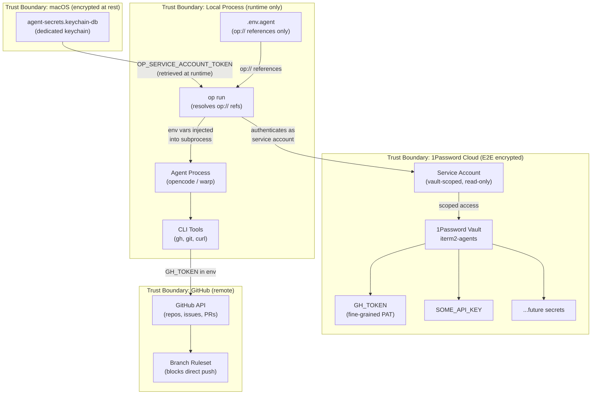
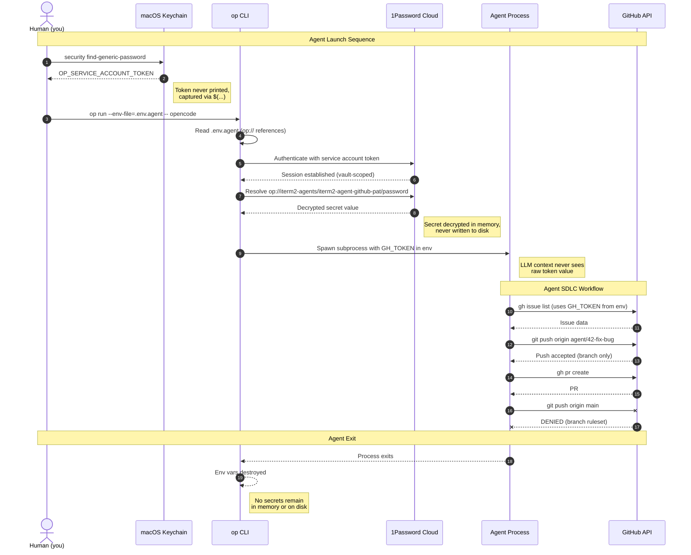
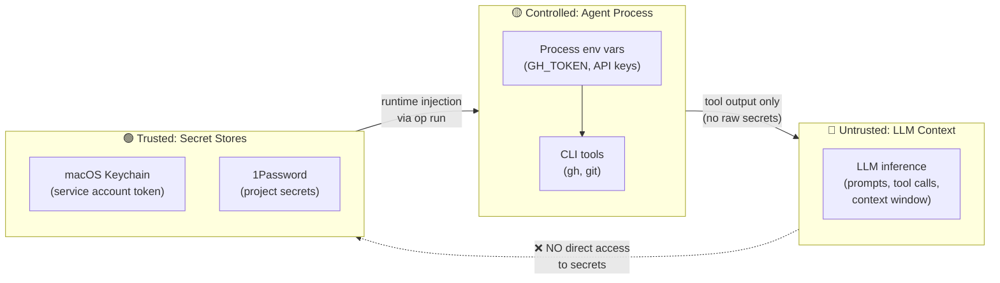
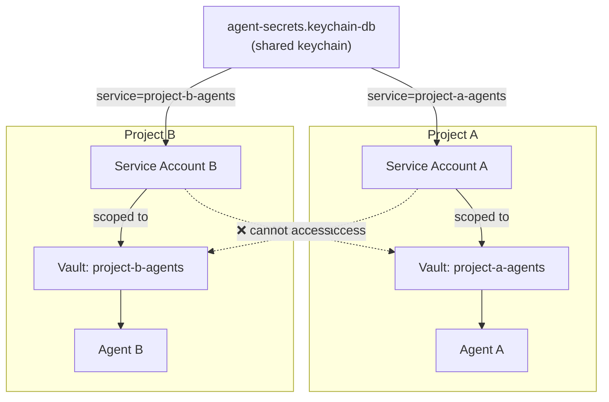

# Agent Secret Management

This guide covers how AI agents (Warp, opencode, etc.) securely access secrets for project workflows — GitHub SDLC automation, CI/CD tokens, API keys, and other integrations.

## Security Principles for AI Agents

AI agents introduce a fundamentally different threat model than traditional server-side applications. An agent's LLM operates in an untrusted inference environment with open-ended context windows and memory. Secrets passed into prompts, embeddings, or agent context cannot be revoked and may be cached, shared with downstream tools, or leaked via prompt injection.

This architecture is designed around four principles aligned with industry best practices from 1Password, OWASP, and HashiCorp:

### 1. Access Without Exposure

Credentials are injected on behalf of the agent at the process level — the LLM never sees raw secrets. The `op run` command resolves `op://` references into environment variables for the subprocess only. The agent's CLI tools (e.g., `gh`) read `GH_TOKEN` from the environment, but the token never appears in the LLM's context window, prompt history, or tool call arguments.

This follows 1Password's principle that "credential exchange must follow a separate, well-defined deterministic permissioned flow" — not through the non-deterministic data channel of the AI agent.

### 2. Vault-Per-Project Isolation

Each project gets its own 1Password vault containing only the secrets that project needs. A 1Password service account is scoped to a single vault, so an agent working on Project A literally cannot see secrets for Project B. This implements the principle of least privilege at the vault level.

### 3. No Plaintext Secrets Anywhere

Secrets never exist as plaintext on disk, in shell history, in process arguments, or in log files:
- The service account token lives in a dedicated macOS Keychain (encrypted, isolated from login keychain)
- Project secrets live in 1Password (encrypted at rest, AES-256-GCM)
- The `.env.agent` file contains only `op://` references (safe to commit)
- `op run` injects secrets as env vars for the subprocess duration only
- When the process exits, the environment variables are gone

### 4. Human-in-the-Loop for Sensitive Operations

The agent cannot perform privileged actions without human oversight:
- Branch rulesets prevent pushing to `main` (agent PAT is not admin)
- The SDLC skill forbids agents from merging PRs, approving issues, or creating releases
- GitHub fine-grained PATs have no Administration scope
- Secret rotation and vault management remain human-only operations

## Architecture

### Component Overview



### Secret Access Flow (Swimlane)



### Trust Boundaries



Key boundaries:
- **Red (Untrusted)**: The LLM context. Secrets must never enter this zone. The LLM sees tool output (e.g., "PR created") but never the token used to create it.
- **Yellow (Controlled)**: The agent process. Secrets exist as env vars here. CLI tools use them to authenticate. This is the minimum necessary exposure.
- **Green (Trusted)**: Secret stores. macOS Keychain and 1Password. Encrypted at rest, access-controlled, audit-logged.

### Multi-Project Isolation



All projects share a single dedicated keychain but use different service names (`-s` flag). Each service account is scoped to exactly one vault. Compromising Agent A's service account reveals nothing about Project B.

## Why This Architecture

AI agents need secrets to automate workflows on your behalf — creating branches, managing issues, opening PRs. But agents should never have access beyond what their specific project requires. The architecture enforces the four security principles above while remaining practical for solo developers and small teams.

Alternative approaches and why they fall short:
- **Hardcoded secrets in `.env` files** — plaintext on disk, easily committed to git, no rotation, no audit trail
- **Secrets in LLM prompts or MCP context** — the LLM may cache, log, or leak them via prompt injection; no revocation model once secrets enter the context
- **Login keychain for agent secrets** — agents gain access to Wi-Fi passwords, browser certificates, and other personal credentials
- **Single shared token for all projects** — compromising one project compromises all; no isolation, no least-privilege

## Prerequisites

- [1Password](https://1password.com/) account (Individual or Teams)
- [1Password CLI](https://developer.1password.com/docs/cli/get-started/) (`op`) installed: `brew install --cask 1password-cli`
- [GitHub CLI](https://cli.github.com/) (`gh`) installed: `brew install gh`
- macOS with Keychain Access

## Quick Start

If you're setting this up for the first time, run through these steps in order:

```bash
# 1. Create a 1Password vault for your project (via 1password.com UI)
# 2. Create a GitHub fine-grained PAT (via github.com UI)
# 3. Store the PAT in the vault (via 1password.com UI)
# 4. Create a 1Password service account scoped to the vault (via 1password.com UI)
# 5. Create a dedicated keychain for agent secrets:
security create-keychain -P agent-secrets.keychain-db

# 6. Store the service account token in the dedicated keychain:
security add-generic-password -a "op-service-account" -s "iterm2-agents" -w agent-secrets.keychain-db

# 7. Create the env file with op:// references:
cat > .env.agent <<'EOF'
GH_TOKEN=op://iterm2-agents/iterm2-agent-github-pat/credential
EOF

# 8. Launch your agent:
OP_SERVICE_ACCOUNT_TOKEN=$(security find-generic-password -a "op-service-account" -s "iterm2-agents" -w agent-secrets.keychain-db) \
  op run --env-file=.env.agent -- opencode
```

The sections below walk through each step in detail.

## Step 1: Create a 1Password Vault

Each project/repo gets its own vault to isolate secrets.

1. Go to [1password.com](https://1password.com) and sign in
2. Click **New Vault**
3. Name it after your project: `iterm2-agents` (or `<project>-agents`)
4. Description: "Secrets for AI agent workflows on the iterm2 repo"

This vault will hold all secrets the agent needs for this project — GitHub tokens, API keys, webhook secrets, etc.

## Step 2: Create GitHub Fine-Grained PATs

You need two PATs with different scopes. Create both at [github.com/settings/personal-access-tokens/new](https://github.com/settings/personal-access-tokens/new).

### Agent PAT (for SDLC automation)

This is the token agents use for day-to-day work — creating branches, managing issues, opening PRs.

- **Name**: `iterm2-agent`
- **Expiration**: 90 days (set a calendar reminder to rotate)
- **Repository access**: Only select repositories → your repo
- **Permissions**:
  - Contents: **Read and write** (push branches)
  - Issues: **Read and write** (comments, labels)
  - Pull requests: **Read and write** (create PRs)
  - Metadata: **Read** (auto-selected)

What the agent **cannot** do with this token:
- Push to `main` (blocked by branch ruleset — agent is not admin)
- Change branch protection or rulesets (no Administration scope)
- Access other repositories (scoped to one repo)

### Release PAT (for CI auto-release workflow)

This token is used by the `auto-release.yml` GitHub Actions workflow to push changelog commits and tags to `main`.

- **Name**: `iterm2-release-bot`
- **Expiration**: 90 days
- **Repository access**: Only select repositories → your repo
- **Permissions**:
  - Contents: **Read and write**
  - Metadata: **Read** (auto-selected)

This token is stored as a **GitHub Actions secret** (not in 1Password) because it's consumed by CI, not by local agents:

```bash
gh secret set RELEASE_TOKEN --repo <owner>/<repo>
# Paste the token when prompted (input is hidden)
```

## Step 3: Store the Agent PAT in 1Password

1. Open 1Password and navigate to your project vault (`iterm2-agents`)
2. Click **New Item** → **Password** (or **API Credential** if available)
3. Fill in:
   - **Title**: `iterm2-agent-github-pat`
   - **Password / Credential**: paste the agent PAT
4. Add custom fields for tracking:
   - `expires`: the expiration date
   - `scopes`: `contents:rw, issues:rw, pull_requests:rw, metadata:r`
   - `repository`: `<owner>/<repo>`
5. Save

The `op://` reference for this item will be:
```
op://iterm2-agents/iterm2-agent-github-pat/password
```

> **Note**: The field name in the `op://` URI depends on the item type. For **Password** items, use `password`. For **API Credential** items, use `credential`. Check the field name in 1Password if unsure.

## Step 4: Create a 1Password Service Account

Service accounts restrict CLI access to specific vaults. The agent authenticates as the service account — not as you — so it can only see secrets in the vaults you grant.

1. Go to [1password.com](https://1password.com) → **Developer** → **Infrastructure Secrets** → **Service Accounts**
2. Click **New Service Account**
3. Configure:
   - **Name**: `warp-agent` (or `<project>-agent`)
   - **Vault access**: Select **only** your project vault (`iterm2-agents`)
   - **Permissions**: Read items (agents should not write to the vault)
4. Click **Create** and copy the generated token

> **Important**: This token is shown only once. If you lose it, you'll need to create a new service account.

## Step 5: Create a Dedicated Keychain

Agents should not have access to your login keychain (which contains Wi-Fi passwords, browser certificates, and other personal credentials). Create a dedicated keychain that holds only agent secrets:

```bash
security create-keychain -P agent-secrets.keychain-db
```

The `-P` flag prompts you for a password via the macOS SecurityAgent dialog (never visible in shell history or process lists). This creates an encrypted keychain file at `~/Library/Keychains/agent-secrets.keychain-db`.

## Step 6: Store the Service Account Token

Store the 1Password service account token in the dedicated keychain:

```bash
security add-generic-password \
  -a "op-service-account" \
  -s "iterm2-agents" \
  -w \
  agent-secrets.keychain-db
```

You will be prompted to enter the token (input is hidden). The parameters:
- `-a` (account): identifier for the credential type
- `-s` (service): your vault/project name (used to look it up later)
- `-w`: prompt for the password interactively (not passed on the command line)
- `agent-secrets.keychain-db`: the target keychain (not the default login keychain)

To verify it was stored:

```bash
security find-generic-password -a "op-service-account" -s "iterm2-agents" agent-secrets.keychain-db
```

This prints metadata (not the token itself). To retrieve the token value (used in scripts):

```bash
security find-generic-password -a "op-service-account" -s "iterm2-agents" -w agent-secrets.keychain-db
```

## Step 7: Create the Environment Reference File

Create `.env.agent` in the project root. This file contains `op://` references — not actual secrets — so it is safe to commit.

```bash
cat > .env.agent <<'EOF'
GH_TOKEN=op://iterm2-agents/iterm2-agent-github-pat/password
EOF
```

The format is:
```
ENV_VAR=op://<vault-name>/<item-title>/<field-name>
```

As you add more integrations, add more lines:
```
GH_TOKEN=op://iterm2-agents/iterm2-agent-github-pat/password
SLACK_WEBHOOK=op://iterm2-agents/slack-webhook/password
SOME_API_KEY=op://iterm2-agents/some-api-key/password
```

## Step 8: Launch the Agent

Combine Keychain retrieval with `op run` to launch the agent with all secrets injected:

```bash
OP_SERVICE_ACCOUNT_TOKEN=$(security find-generic-password -a "op-service-account" -s "iterm2-agents" -w agent-secrets.keychain-db) \
  op run --env-file=.env.agent -- opencode
```

What happens:
1. `security` retrieves the service account token from Keychain
2. `OP_SERVICE_ACCOUNT_TOKEN` authenticates the `op` CLI as the service account
3. `op run` resolves all `op://` references in `.env.agent` into real values
4. The agent process receives secrets as environment variables
5. When the process exits, the environment variables are gone

### Shell Alias (optional)

Add to your `~/.zshrc` or `~/.modern-terminal/custom.zsh` for convenience:

```bash
agent-opencode() {
  OP_SERVICE_ACCOUNT_TOKEN=$(security find-generic-password -a "op-service-account" -s "iterm2-agents" -w agent-secrets.keychain-db) \
    op run --env-file="${1:-.env.agent}" -- opencode
}
```

Usage:
```bash
agent-opencode                    # Uses .env.agent in current dir
agent-opencode .env.agent.dev     # Uses a different env file
```

## Adding New Secrets

When a new integration requires a secret:

1. **Create the secret** (API key, token, etc.) from the provider
2. **Store in 1Password** → your project vault → new Password item
3. **Add the `op://` reference** to `.env.agent`:
   ```
   NEW_SECRET=op://iterm2-agents/new-item-title/password
   ```
4. **Restart the agent** — `op run` resolves references at launch time

No code changes, no plaintext, no environment variable exports.

## Applying to Other Projects

To set up agent secrets for a new project:

1. Create a new 1Password vault: `<project>-agents`
2. Create a new service account scoped to that vault
3. Store the service account token in the dedicated keychain:
   ```bash
   security add-generic-password -a "op-service-account" -s "<project>-agents" -w agent-secrets.keychain-db
   ```
4. Create the project's `.env.agent` with `op://` references
5. Launch with the project-specific Keychain entry:
   ```bash
   OP_SERVICE_ACCOUNT_TOKEN=$(security find-generic-password -a "op-service-account" -s "<project>-agents" -w agent-secrets.keychain-db) \
     op run --env-file=.env.agent -- opencode
   ```

All projects share the same `agent-secrets.keychain-db` keychain but use different `-s` (service) names. Each is fully isolated — different vault, different service account, different Keychain entry.

## Token Rotation

Fine-grained PATs expire. When a token nears expiration:

1. Create a new PAT on GitHub with the same scopes
2. Update the item in 1Password (paste new token)
3. If it's the release PAT: also update the GitHub Actions secret:
   ```bash
   gh secret set RELEASE_TOKEN --repo <owner>/<repo>
   ```
4. No changes needed to `.env.agent` or the Keychain — the `op://` reference resolves to the updated value automatically

## Troubleshooting

### `op` says "not signed in"
Make sure `OP_SERVICE_ACCOUNT_TOKEN` is set. The service account token authenticates the CLI — it does not use your desktop app sign-in.

### `op run` says "could not resolve" an `op://` reference
Check that:
- The vault name in the URI matches exactly (case-sensitive)
- The item title matches exactly
- The field name is correct (`password` for Password items, `credential` for API Credential items)
- The service account has access to the vault

### `security` command hangs or prompts for password
If the dedicated keychain is locked, unlock it first:
```bash
security unlock-keychain agent-secrets.keychain-db
```
The keychain locks after a reboot or timeout. Unlock it with the password you set during creation.

### Agent can push to `main` unexpectedly
The agent PAT should belong to a non-admin user, or the branch ruleset should block non-bypass actors. Verify:
```bash
gh api repos/<owner>/<repo>/rulesets --jq '.[].bypass_actors'
```

## References

### Standards
- [OWASP Secrets Management Cheat Sheet](https://cheatsheetseries.owasp.org/cheatsheets/Secrets_Management_Cheat_Sheet.html) — organization-wide secrets management best practices
- [OWASP SAMM — Secret Management](https://owaspsamm.org/model/implementation/secure-deployment/stream-b/) — inject production secrets during deployment, not before

### 1Password Official
- [Secure Agentic AI](https://1password.com/solutions/agentic-ai) — 1Password's approach to AI agent authentication and credential control
- [Security Principles Guiding 1Password's Approach to AI](https://1password.com/blog/security-principles-guiding-1passwords-approach-to-ai) — raw secrets have no place in LLM context
- [Where MCP Fits and Where It Doesn't](https://blog.1password.com/where-mcp-fits-and-where-it-doesnt/) — why 1Password will not expose raw credentials via MCP
- [Securing MCP Servers with 1Password](https://1password.com/blog/securing-mcp-servers-with-1password-stop-credential-exposure-in-your-agent) — the `op run` + `op://` pattern for AI tools
- [1Password Service Accounts](https://developer.1password.com/docs/service-accounts/) — vault-scoped, least-privilege access for automation
- [Load Secrets into the Environment](https://developer.1password.com/docs/cli/secrets-environment-variables/) — `op run` documentation

### AI Agent Patterns
- [HashiCorp Vault: AI Agent Identity](https://developer.hashicorp.com/validated-patterns/vault/ai-agent-identity-with-hashicorp-vault) — enterprise dynamic secrets for AI agents with OAuth 2.0 token exchange
- [Fast.io: AI Agent Credential Vault](https://fast.io/resources/ai-agent-credential-vault/) — every AI agent should have its own unique credentials
- [Scalekit: Token Vault for AI Agent Workflows](https://www.scalekit.com/blog/token-vault-ai-agent-workflows) — centralized credential management for autonomous agents
- [Secret Management for AI Coding Agents (op-env)](https://gist.github.com/DAESA24/dc26fa5b63fcd6b4c688772c9d0eb5ca) — community pattern for 1Password + interactive CLI agents

### Blog Posts
- [Stop Putting Secrets in .env Files](https://jonmagic.com/posts/stop-putting-secrets-in-dotenv-files/) — vault-per-project pattern with 1Password and macOS Keychain
- [Keeping Credentials Out of Code](https://www.infralovers.com/blog/2025-11-05-credential-management-1password-vault/) — `op run` for runtime injection without shell history exposure
- [NSHipster: op run](https://nshipster.com/1password-cli/) — dynamically inject secrets from 1Password vaults into development workflows
