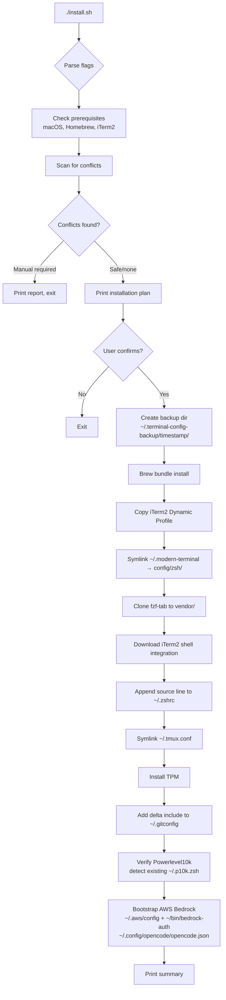
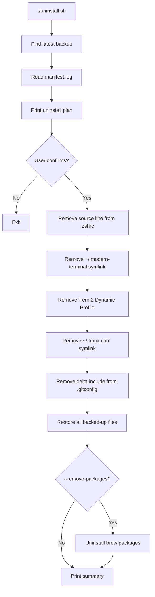
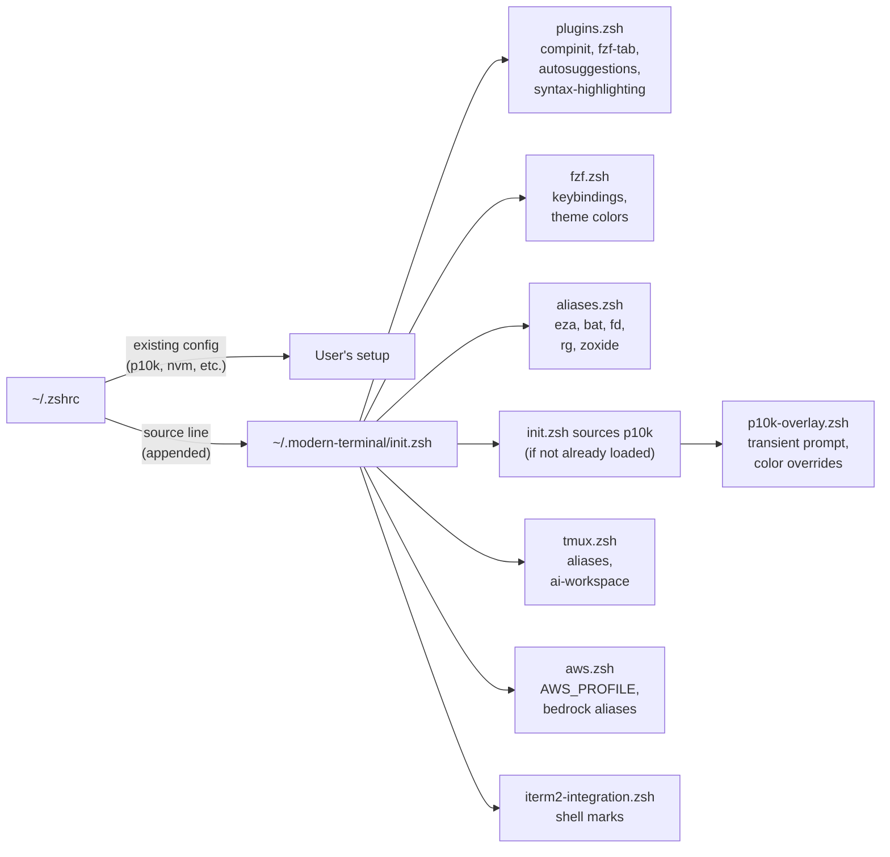
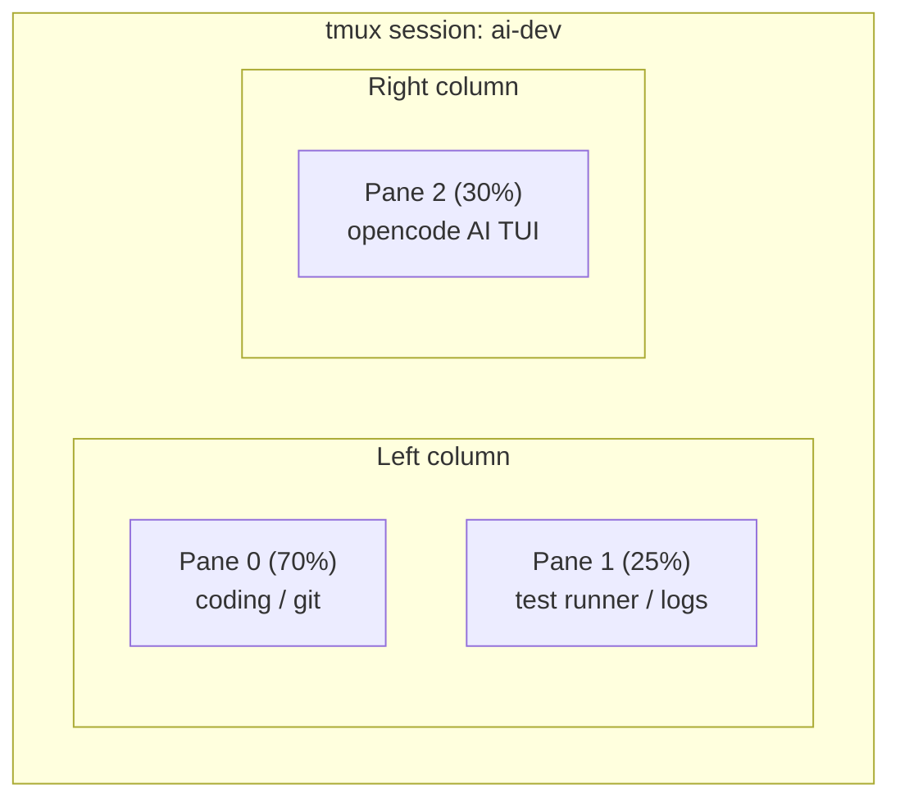

# Architecture

## Design Principles

1. **Non-destructive** — every changed file is backed up before being touched
2. **Reversible** — `uninstall.sh` restores all backups and removes only what was added
3. **Transparent** — install prints a plan and asks for confirmation
4. **Modular** — each feature can be skipped independently

## Install Flow



## Uninstall Flow



## Zsh Sourcing Chain



## tmux AI Workspace Layout



## File System Layout

```
~/.zshrc                          ← one line appended (source ~/.modern-terminal/init.zsh)
~/.modern-terminal/               ← symlink → repo/config/zsh/
~/.tmux.conf                      ← symlink → repo/config/tmux/tmux.conf
~/.tmux/plugins/tpm/              ← TPM (cloned at install time)
~/.gitconfig                      ← [include] path added for delta
~/.iterm2_shell_integration.zsh   ← downloaded at install time
~/Library/Application Support/iTerm2/DynamicProfiles/dracula.json
~/bin/bedrock-auth                ← AWS SSO auth helper (copied from scripts/bedrock-auth.sh)
~/.aws/config                     ← WFS-Architects-RD profile + my-sso session (appended by installer)
~/.config/opencode/opencode.json  ← OpenCode config (amazon-bedrock provider, us-east-1)

~/.terminal-config-backup/
  └── 20240101_120000/
      ├── manifest.log            ← action log for uninstall
      ├── .zshrc                  ← original zshrc
      ├── .tmux.conf              ← original tmux config (if any)
      └── .gitconfig              ← original gitconfig
```

## Conflict Detection

The installer scans `~/.zshrc` before making changes and reports:

- **Duplicate plugins** — loading the same plugin twice causes slowdowns
- **Competing prompts** — multiple prompt themes clobber each other
- **Alias collisions** — existing aliases for ls, cat, cd, etc.
- **Duplicate compinit** — multiple calls are expensive; ours skips if already loaded
- **tmux conflicts** — different prefix keys or existing TPM installs
- **fzf conflicts** — duplicate keybinding sources

Each conflict is classified as:
- `safe:` — handled automatically, no action needed
- `comment out or use --skip-*` — installer can work around it
- `manual:` — user must fix before installing (blocks install)
